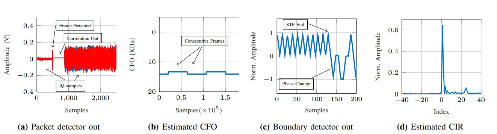
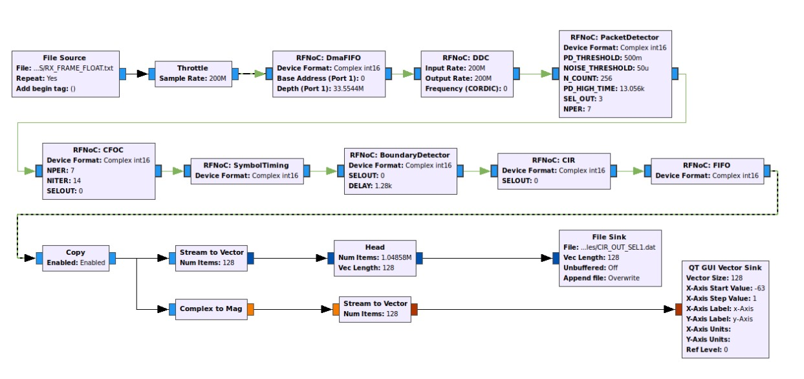
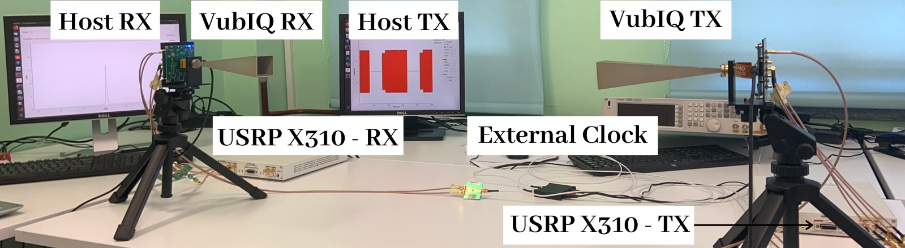

# MISO

MISO Project propose a mixed hardware-software design for millimeter wave (mm-wave) experimentation on software-defined radios (SDR). Specifically, the basic blocks required to process the preamble of 802.11ad compliant single carrier frames have been designed allowing mm-wave experimentation with USRP boards at a scaled-down bandwidth, compared to the one defined in the standard (1.76GSPS). The preamble processing blocks have been integrated in the GNU-Radio + RFNoC framework.

This compressed file includes an user manual with the description of the signal processing blocks developed for MISO project implemented using RFNoC framework. Besides, a folder containing he RFNoC source files, FPGA Image with all the implemented blocks, Example of GNURadio source files containing IEEE 802.11ad compliant single carrier frames with different MCS, and Vivado LS source files for the corresponding blocks are also included.

## License

"THE SOFTWARE IS PROVIDED "AS IS", WITHOUT WARRANTY OF ANY KIND, EXPRESS OR IMPLIED, INCLUDING BUT NOT LIMITED TO THE WARRANTIES OF MERCHANTABILITY, FITNESS FOR A PARTICULAR PURPOSE AND NONINFRINGEMENT. IN NO EVENT SHALL THE AUTHORS OR COPYRIGHT HOLDERS BE LIABLE FOR ANY CLAIM, DAMAGES OR OTHER LIABILITY, WHETHER IN AN ACTION OF CONTRACT, TORT OR OTHERWISE, ARISING FROM, OUT OF OR IN CONNECTION WITH THE SOFTWARE OR THE USE OR OTHER DEALINGS IN THE SOFTWARE. "

## Cite this work

If you use it in your research work, please acknowledge the source and cite the publication below:  
>***Open Source RFNoC-Based Testbed for Millimeter-Wave Experimentation Using USRP Software Defined Radios***
>-- Adriana Moreno, Jesus Omar Lacruz, and Joerg Widmer --
>In International Symposium on Circuits and Systems (ISCAS), 2020
